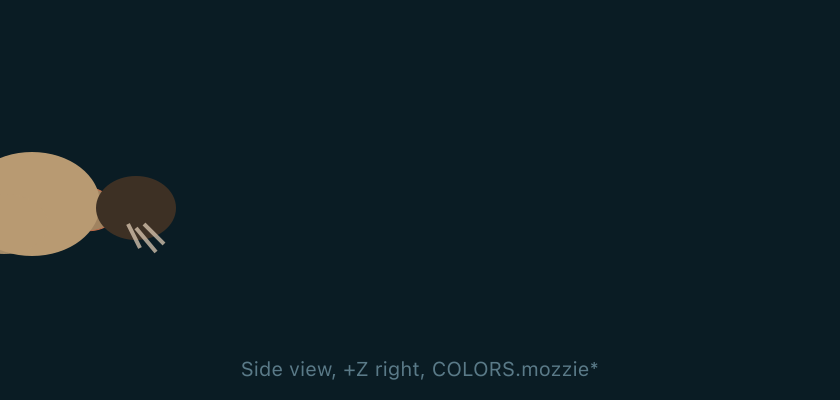
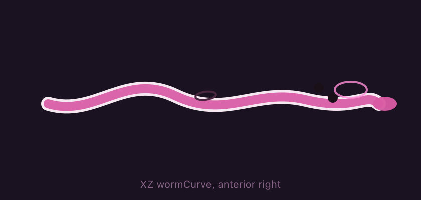
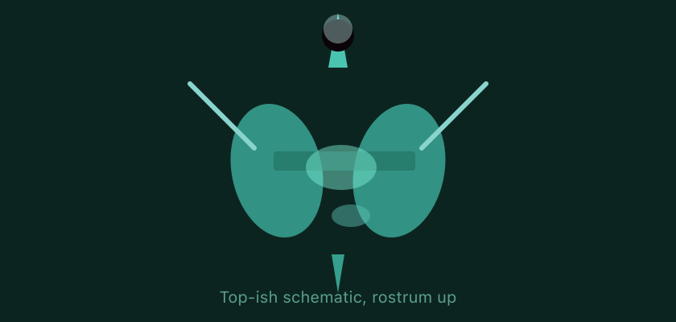
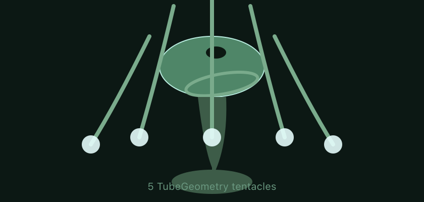
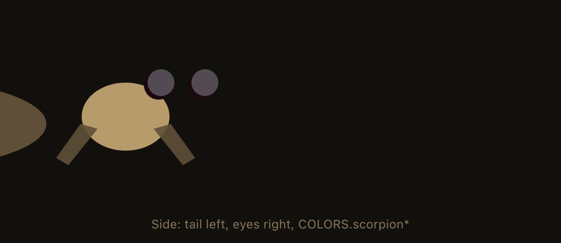
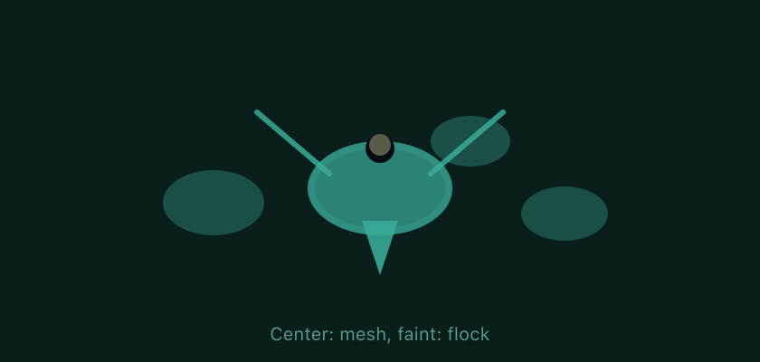

# Enemies reference

Sandbox track with **every predator** plus **Daphnia flocks**:

`tracks/debug/arena_all_enemies.yaml`

Enable **Debug** mode and pick **Debug · all enemies** in the track bar, or load that YAML via your usual flow.

**Diagrams** are **PNG** (rasterized from SVG) so they show up on **GitHub** and other hosts that strip inline SVG. Editable vector sources live alongside them in `docs/enemies/images/*.svg` (run `rsvg-convert` after edits to refresh PNGs).

| Enemy / flock | Mesh builder (source of truth for the diagram) |
|---------------|-----------------------------------------------|
| Mosquito larva | `predatorMozzieMesh` |
| Planarian | `predatorPlanarianMesh` (`wormCurve`, `headAimGrp`) |
| Daphnid charger | `predatorDaphnidMesh` |
| Hydra pod | `predatorHydraPodMesh` |
| Waterscorpion tank | `predatorWaterScorpionTankMesh` |
| Daphnia flock member | `daphniaFlockMemberMesh` |

---

## Mosquito larva (`mosquito_larva`)

| Mechanism | Detail |
|-----------|--------|
| **Role** | Aggressive grazer / hull parasite |
| **Movement** | Patrols near spawn until you enter **engage radius**, then chases. **Latches** to a point slightly **aft of your keel** (same heading as you) for a limited “stuck” run, then **backs off** toward its home and patrols again. |
| **Damage** | **Melee** on hull overlap: repeated **parasite bleed** on an interval (`biteIntervalSec`). Cone-based venom bite from the player can chip HP via **weak-centroid** rules (no armour weak spots). |
| **Presentation** | Attack pose animates the rig; head **aims at the swimmer** while stalking / latched. |

**Defaults (YAML overrides allowed):** see `PRED_KIND_DEFAULTS.mosquito_larva` in `src/trackLoader.js`.

---

## Planarian spitter (`planarian_spitter`)

| Mechanism | Detail |
|-----------|--------|
| **Role** | Soft, calm chaser with **ranged toxin globs** |
| **Melee** | Light bite / **shell contact bleed** on overlap; lower base melee than larva. |
| **Ranged** | **Pink glob** projectile toward you (with **lead bias**). **Head / sucker aim** at you while lining up and right after a shot. Projectile size uses a **smaller base radius** plus slight **per-shot random** scale. |
| **Movement** | After a successful spit: **snake-like retreat** away from you, **idle** a few seconds, then **stalks again** like other grazers. No volleys during retreat / wait. |
| **Spawn point** | Glob exits from the **head pivot** (mouth end), not the generic mozzie offset. |

**Defaults:** `planarian_spitter` in `src/trackLoader.js`.

---

## Daphnid charger (`daphnid_charger`)

| Mechanism | Detail |
|-----------|--------|
| **Role** | Fast **cladoceran-style** charger |
| **Movement** | Same stalk pattern as generic grazers: idle near **home** until you are inside **engage radius**, then **chases** your position. |
| **Damage** | **Melee-only**: parasite bleed ticks on hull contact; **low HP** (often one good venom bite). |
| **Presentation** | Hinged shell / rostrum mesh; no ranged. |

**Defaults:** `daphnid_charger` in `src/trackLoader.js`.

---

## Hydra pod (`hydra_pod`)

| Mechanism | Detail |
|-----------|--------|
| **Role** | Mostly **stationary / slow** polyp analogue |
| **Melee** | Preset has negligible melee `damage`; engagement is about **ranged**. |
| **Ranged** | **Cyan-styled** projectiles on cooldown; high **max range** / chunky **projectile radius** relative to planarian. |
| **Movement** | Very low **chaseSpeed** — barely nudges toward you inside engage bubble. |

**Defaults:** `hydra_pod` in `src/trackLoader.js`.

---

## Waterscorpion tank (`waterscorpion_tank`)

| Mechanism | Detail |
|-----------|--------|
| **Role** | Heavy **armoured** grazer |
| **Weak spots** | **Eyes** and **tail hinge** in local space — overlapping those volumes with the player deals full **parasite** damage. |
| **Hull** | If you touch the shell without hitting a weak spot, only **shell contact bleed** (`shellContactBleed`) applies — much less than a weak hit. |
| **Venom** | **Lower susceptibility** than soft grazers; weak spots use **directional venom cone** logic so bites matter from the front arc. |
| **HP** | High — intended as a mini-boss feel on a course. |

Weak spot offsets: `WEAK_SCORPION_PRESET_RAW` in `src/trackLoader.js`.

---

## Daphnia flock (`obstacles.daphnia` / `daphnia_flocks`)

| Mechanism | Detail |
|-----------|--------|
| **Role** | **Non-predator** swarm — many tiny copies with **flocking** (cohesion, separation, flee). |
| **Flee** | Accelerates away when you enter about **scareRadius**. |
| **Hull** | Members can **scrape** the hull for small capped DPS when you swim through the swarm (not a single “attack”, more abrasion). |
| **Splash / fin-kick** | **Dive splash** and **mega fin-kick** wedge can **burst** members; they despawn and drop **nibble** pickups / score per `pointValuePer`. |

Configured per flock in YAML: `count`, `spread`, `fleeSpeed`, `scareRadius`, `splashHitRadius`, etc. See `normalizeDaphniaFlocks` in `src/trackLoader.js`.

---

## Related code

| Concern | Location |
|---------|----------|
| Track merge + predator presets | `src/trackLoader.js` |
| Predator AI / melee / ranged | `src/Game.js` |
| Meshes & mozzie / larva / planarian movement helpers | `src/sceneMeshes.js` |
| Debug track picker | `src/main.js` → `DEBUG_TRACK_ENTRIES` |

---

## Other hazards (not on the all-enemy arena)

**Patrol fish** and **rivals** can deal collisions / race pressure; see `tracks/lily_loop.yaml` for a fuller obstacle mix. They are **not** defined in `predators` and are not covered by the diagrams above.
